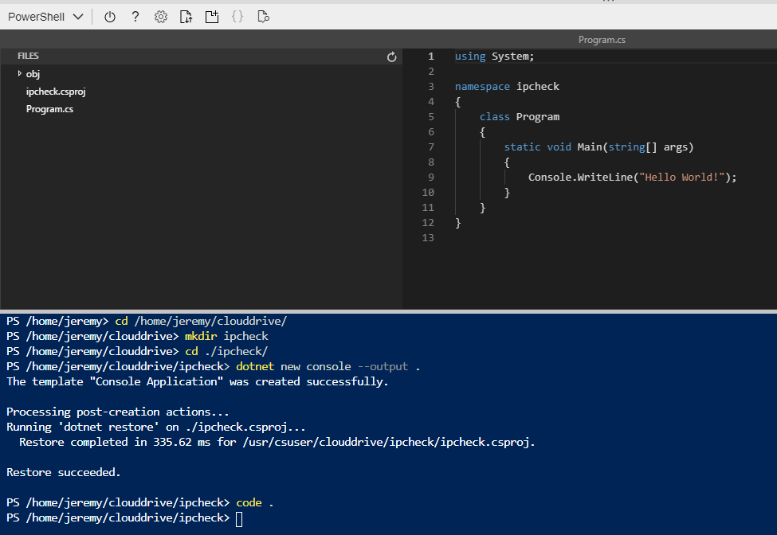

# Azure - Docker

## Purpose
At the end of this module, you will:
* Create a VM by using the Azure Command-Line Interface (CLI).
* Deploy a Docker container image to Azure Container Registry.
* Deploy a container image into Container Registry and spin it up using Container Instances.

### ![Create VM to host our Container][activity] 2.70.1 Create VM to host our Container

In the Azure Portal let's create a VM to host our Container, in the first exercise we created a VM manually, this time lets create the VM programmatically! 

> This is a labourious exercise without much gain. I took it from Microsoft: https://microsoftlearning.github.io/AZ-204-DevelopingSolutionsforMicrosoftAzure/Instructions/Labs/AZ-204_05_lab.html. In the topic after next we'll create a Web Site and host it on Docker then spin it up on a Kubernetes Cluster. Often you will need a consoole based Docker Container for things such as scheduling tasks. This exercise demonstrates how to containerise a console app.

#### 2.70.2 Create Resource Group

First we'll go ahead and create a Resource Group with the following details:

1.	Name it ContainerCompute

1.	Set the location Australia Southeast

```
az group create --name ContainerCompute --location australiasoutheast
```

#### 2.70.3 Create VM in using Cloud Shell


3.	Open a new Cloud Shell instance in the Azure portal using Bash

4.	Run this az command with the --help flag to find a list of subgroups and commands at the root level of the CLI.
```
az --help
```
5.	Run this az vm command with the -help flag to find a list of subgroups and commands for Azure Virtual Machines:
```
az vm --help
```
4.	Run this az vm create command with the --help flag to find a list of arguments and examples for the Create Virtual Machine command:
```
az vm create --help
```

Essentially you should be able work out how to put togeether the following command yourself using Help.

5.	Run this az vm create command to create a new VM with the following settings:
* Resource group: ContainerCompute
* Name: quickvm
* Image: Debian
* Username: student
* Password: P@ssw0rd456abc

> Wait for the VM creation process to complete. After the process completes, the command will return a JavaScript Object Notation (JSON) file with details about the machine.

```
az vm create --name quickvm --resource-group ContainerCompute --image Debian --admin-username student --admin-password P@ssw0rd456
```

6. Use the az vm list-ip-addresses command and the –query argument to filter the output to only return the first IP address value:

```
az vm list-ip-addresses --resource-group ContainerCompute --name quickvm --query '[].{ip:virtualMachine.network.publicIpAddresses[0].ipAddress}' --output tsv
```

7. Run this command to store the results of the previous command in a new Bash shell variable named ipAddress:
```
ipAddress=$(az vm list-ip-addresses --resource-group ContainerCompute --name quickvm --query '[].{ip:virtualMachine.network.publicIpAddresses[0].ipAddress}' --output tsv)
```

8. Run this command to render the value of the Bash shell variable ipAddress:
```
echo $ipAddress
```

9.	Open a command prompt and run this command to connect to the VM via SSH and the IP address stored in the Bash shell variable ipAddress: 

```
ssh student@$ipAddress
```

10.	During the connection process, you’ll receive a warning that the authenticity of the host can’t be verified. Continue connecting to the host. Finally, use the password P@ssw0rd456abc when prompted for credentials

11.	After connecting to the VM, use the following command to get information about the machine to ensure that you’re connected to the correct VM: 

```
uname -a
```


### ![Create and deploy Docker container image][activity] 2.70.4 Create a Docker container image and deploy container registry

#### 2.70.5 Open the Cloud Shell and editor

1.	In the Cloud Shell instance in the Azure portal.

1.	Change the active directory to ~/clouddrive.

> The command to change directory in Bash is *cd path*.

```
cd ~/clouddrive
```

3.	At the Cloud Shell command prompt, create a new directory named ipcheck in the ~/clouddrive directory.

> The command to create a new directory in Linux is mkdir directory name.

```
mkdir ipcheck
```

4.	Issue the command to change the directory to ~/clouddrive/ipcheck.

```
cd ~/clouddrive/ipcheck
```

5.	Use the dotnet new console -output . -name ipcheck command to create a new .NET console application in the current directory.

```  
dotnet new console --name ipcheck --output .
```

6.	Create a new file in the ~/clouddrive/ipcheck directory named Dockerfile.
Note: The command to create a new file in Bash is touch filename. The file name Dockerfile is case sensitive.

```
touch Dockerfile
```

7.	Open the embedded graphical editor in the context of the current directory:

```
code .
```

Note: You open the editor by using the "code ." command or by selecting the editor button in the Cloud Shell toolbar. The editor will give us a view of the dotnet console app we just created.



#### 2.70.6 Create and test a .NET application

1.	In the graphical editor, open the Program.cs file and replace its contents with the following code, and then save the file: 

```
public class Program
{
    public static void Main(string[] args)
    {        
        // Check if network is available
        if (System.Net.NetworkInformation.NetworkInterface.GetIsNetworkAvailable())
        {
            System.Console.WriteLine("Current IP Addresses:");

            // Get host entry for current hostname
            string hostname = System.Net.Dns.GetHostName();
            System.Net.IPHostEntry host = System.Net.Dns.GetHostEntry(hostname);
                
            // Iterate over each IP address and render their values
            foreach(System.Net.IPAddress address in host.AddressList)
            {
                System.Console.WriteLine($"\t{address}");
            }
        }
        else
        {
            System.Console.WriteLine("No Network Connection");
        }
    }
}
```

2. Use the *dotnet run* command at the command prompt to run the application and validate that it finds one or more IP addresses.

```
dotnet run
```

3. Open the Dockerfile file in the graphical editor, replace its contents with the following code, and then save the file: 

```
# Start using the .NET Core 2.2 SDK container image
FROM mcr.microsoft.com/dotnet/core/sdk:2.2-alpine AS build

# Change current working directory
WORKDIR /app

# Copy existing files from host machine
COPY . ./

# Publish application to the "out" folder
RUN dotnet publish --configuration Release --output out

# Start container by running application DLL
ENTRYPOINT ["dotnet", "out/ipcheck.dll"]
```

#### 2.70.7 Create a Container Registry resource

Create a new container registry with the following details:
1. Resource group: ContainerCompute

1. Name: Any globally unique name [uniquename123lowercase]

1. Location: Australia SouthEast

1. SKU: Basic

1. Click Review + Create

#### 2.70.8 Open Azure Cloud Shell and store Container Registry metadata

1.	Open Cloud Shell.

1.	At the Cloud Shell command prompt, use the az acr list command to get a list of all container registries in your subscription.

1.	Use the following command to output the name of the most recently created container registry: 

```
az acr list --query "max_by([], &creationDate).name" --output tsv
```

4.	Use the following command to save the name of the most recently created container registry in a Bash shell variable named acrName: 
```
acrName=$(az acr list --query "max_by([], &creationDate).name" --output tsv)
```

5.	Use the following script to render the value of the Bash shell variable acrName: 
echo $acrName


#### Deploy a Docker container image to Container Registry

1. Change the active directory to ~/clouddrive/ipcheck.

2. Use the dir command to get the contents of the current directory.

> You’ll know that you’re in the correct directory if both the Program.cs and Dockerfile files that you edited earlier in this lab are there.

3. Use the following command to upload the source code to your container registry and build the container image as a Container Registry task:

```
az acr build --registry $acrName --image ipcheck:latest .
```

#### 2.70.9 Deploy a Docker container image to Container Registry

1. Access the container registry that you created earlier in this lab.

1. Select the Repositories link to find your images in the registry.

1. Proceed through the Images and Tags blades to find the metadata associated with the ipcheck image with the latest tag.

> You can also select the Run ID link to find the build task metadata.

That completes this module where you created a .NET console application to display a machine’s current IP address. You then added the Dockerfile file to the application to convert it into a Docker container image. Finally, you deployed the container image to the Azure Container Registry.

Please don't delete these resources.


[activity]: ../icons/activity.png "Workshop Activity!"
[discussion]: ../icons/discussion.png "Team Discussion!"
[reading]: ../icons/reading.png "Further Reading!"
