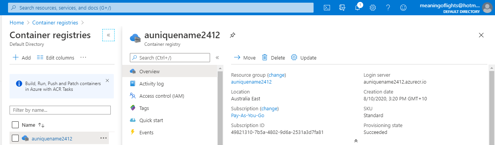
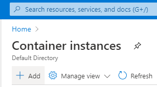

# Azure - Docker

### ![Deploy an Azure Container Instance][activity] 2.71.1 Deploy an Azure Container Instance

In the Azure Portal let's deploy our .Net Console App Container via the Azure Container Instance service!

Ref: https://microsoftlearning.github.io/AZ-204-DevelopingSolutionsforMicrosoftAzure/Instructions/Labs/AZ-204_05_lab.html

#### 2.71.2 Enable the admin user in Container Registry

1. Access the container registry that you created earlier in this lab.

2. Click Update to find the settings for the container registry.

3. Enable the Admin User, Save your changes, and then close the Update container registry blade.

#### 2.71.3 Automatically deploy a container image to an Azure container instance

1. Select the Repositories link to find your images in the registry.

1. Select the ipcheck image, and then find the latest tag for the image.

1. Right-click the latest tag or activate the shortcut menu for the ipcheck container image to “run” a new Azure Container Instance with the following settings:

* Container name: managedcompute
* OS type: Linux
* Resource group: ContainerCompute
* Location: Australia SouthEast
* Number of cores: 2
* Memory (GB): 4
* Public IP address: No

> Wait for the creation task to complete before moving on with this lab.

#### 2.71.4 Manually deploy a container image to Container Instances

1. Access the container registry that you created earlier in this lab.

1. Select the Access keys link to find the credentials necessary to access your container registry from another service. Record the following values from this section to use later in this lab:

* Login server
* Username
* Password

> You’ll use these values later when you create another container instance.

3. Create a new container instance with the following information using the Access keys credentials that you recorded earlier in this lab:

* Resource group: ContainerCompute
* Container name: managedcompute
* Region: Australia SouthEast
* Image source: Azure Container Registry
* Registry: Choose the Azure Container Registery resource created earlier in the lab
* Image: ipcheck
* Image tag: latest

> Wait for the creation task to complete before moving forward with this lab.

#### 2.71.5 Validate that the container instance ran successfully

1. Access the managedcompute container instance that you created earlier in this lab.

1. Select the Containers link to get a list of the current containers that are running.

1. Find the contents of the Events list for the container instance that ran your ipcheck application.

1. Select the Logs tab, and then find the text logs from the container instance.

> You can optionally find the Events and Logs from the managedcompute container instance.

That completes this module where you enabled the admin user in the Container Registry,and used multiple methods to deploy a container image to an Azure container instance. By using the manual method, you were also able to customize the deployment further and run task-based applications as part of a container run.

[activity]: ../icons/activity.png "Workshop Activity!"
[discussion]: ../icons/discussion.png "Team Discussion!"
[reading]: ../icons/reading.png "Further Reading!"
