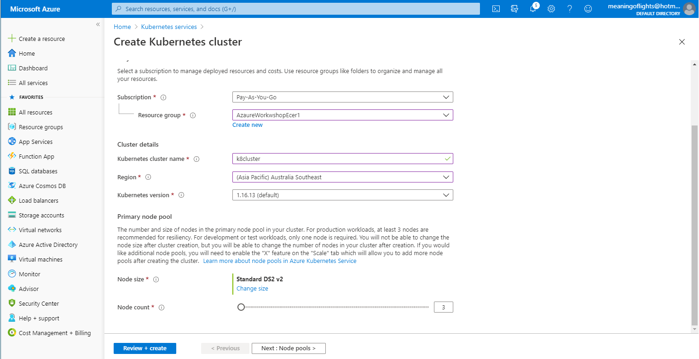
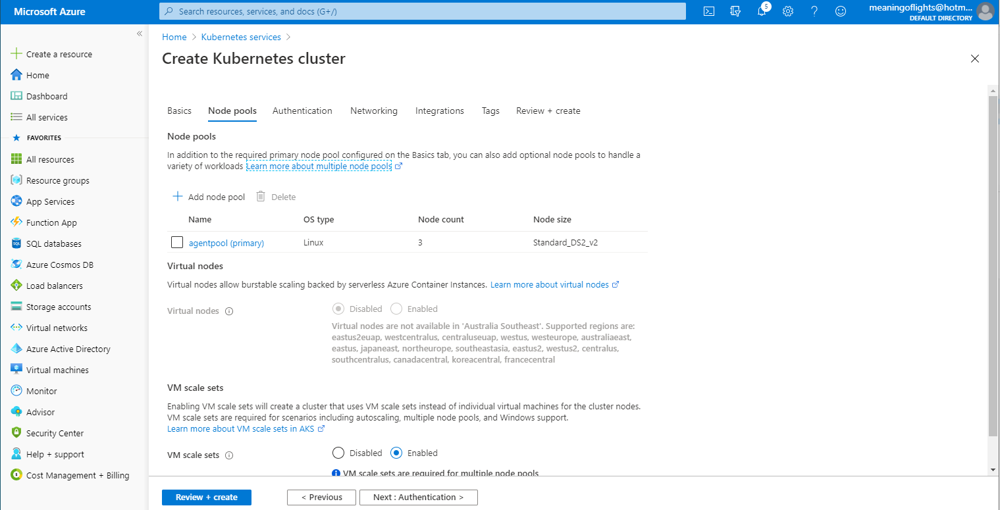
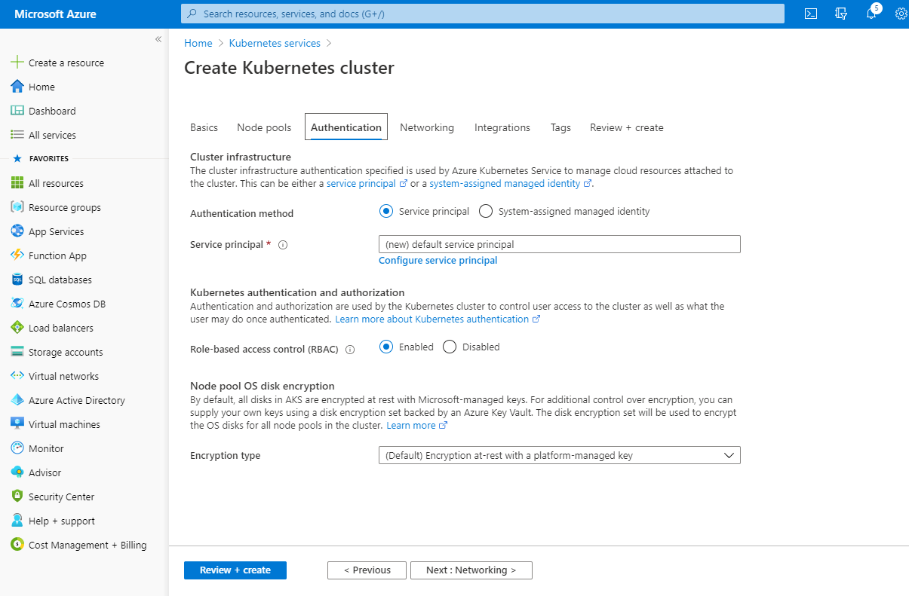
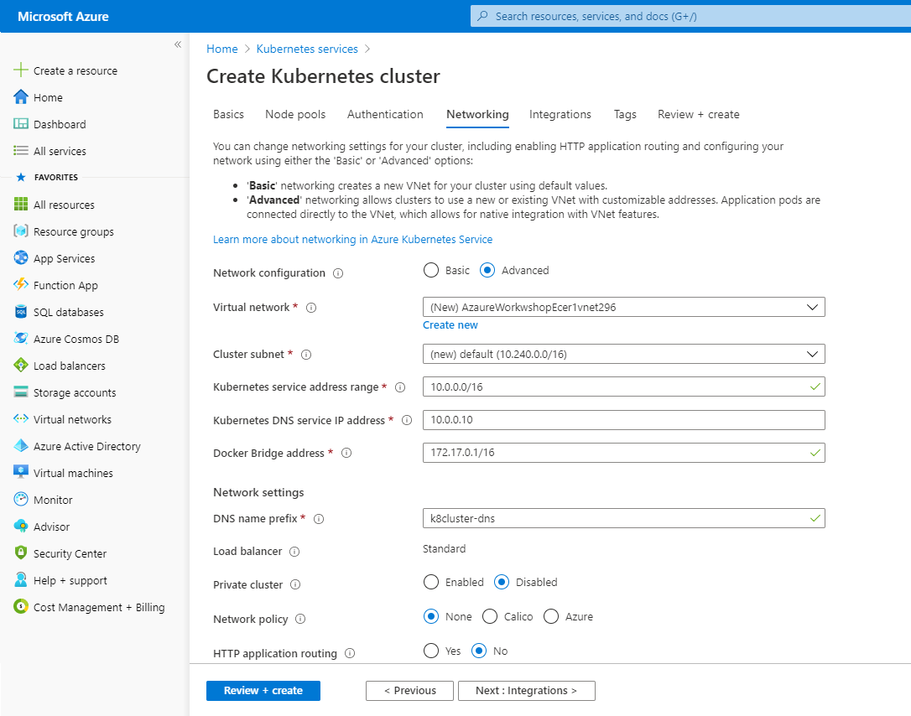
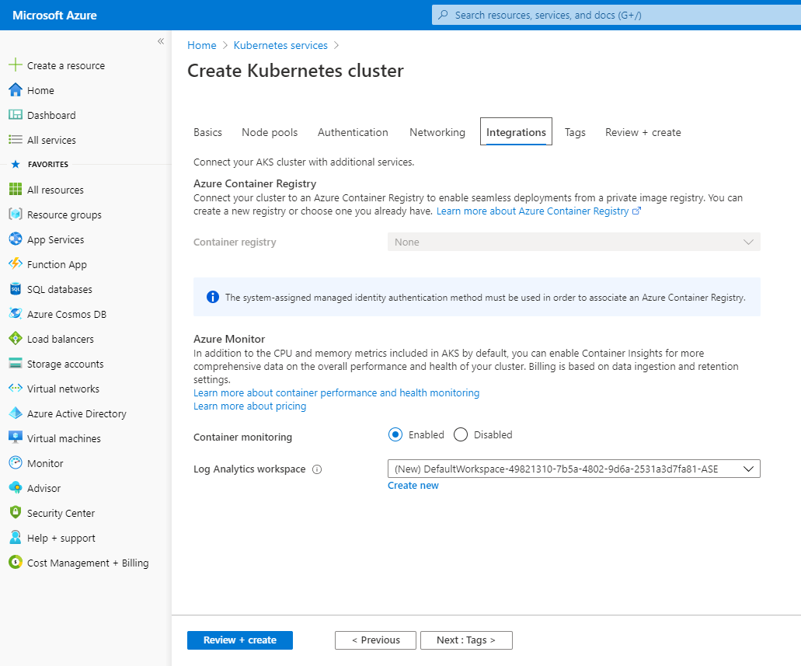
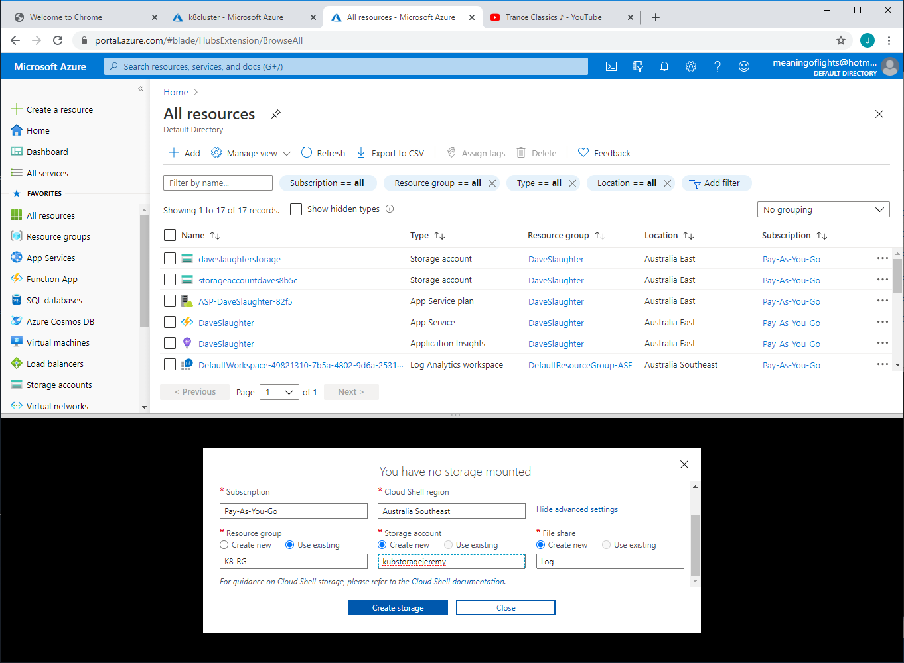
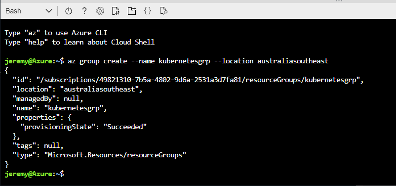
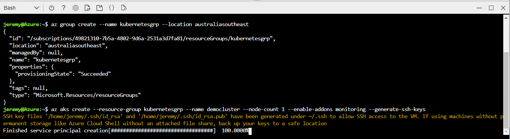
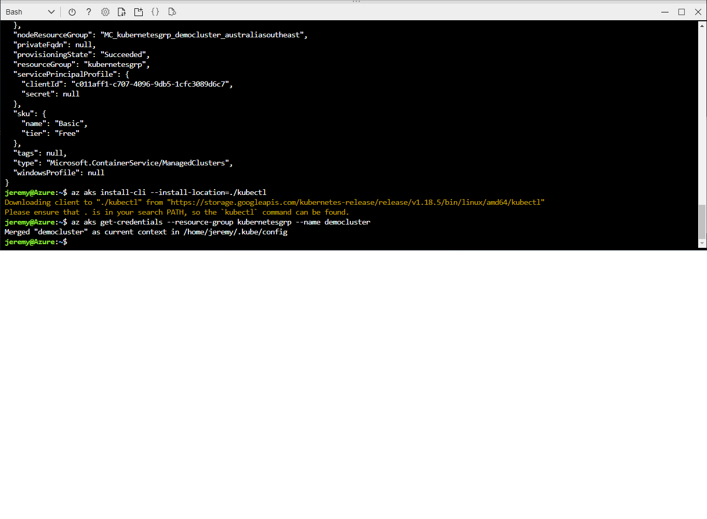
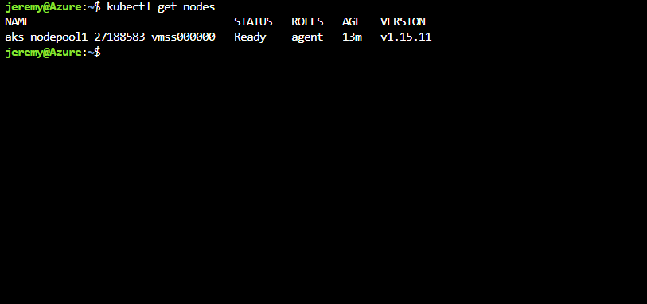

# Azure - Kubernetes

Kubernetes is one of the most commonly used services in all 3 major Cloud Providers. It was built by Google based on a product called Borg. Cloud providers have trouble attracting clients from other cloud providers and Google thought by open sourcing Kubernetes which provides portable containers they could win over the market. Turns out that Azure and AWS have integrated Kubernetes into their cloud offerings.

## Purpose
At the end of this module, you will:
* Spin up a Kubernetes Cluster the portal
* Spin up a Kubernetes Cluster using the CLI

## Creating a Azure Kubernetes cluster

Now we come to the part where we're going to be looking at Azure Kubernetes as a service using the Azure Portal.

> Note: This topic first looks at creating a Kubernetes Cluster using the Portal, however we are going to create the Kubernetes Cluster using the CLI.

### ![Building a Azure Kubernetes cluster][activity] 2.80.1 Building a Azure Kubernetes cluster

1. On the Azure portal menu (top left menu icon), select create a resource.

1. Select the Kubernetes.


3. Create a new Resource Group K8RG and enter Cluster name k8cluster. Notice at the bottom you can set the number of Nodes, leave 3 as default. The nodes are the Virtual Machines hosting the containers.



4. Next is the Node Pools where we define the scaling behaviour. Leave the defaults.



5. In the Authentication tab is the Service Princial that allows Kubernetes to talk with other Azure services. For example if Kubernetes needs to pick up the Container from the Container Registry then it will use this Service Principal account.



6. In the Networking tab by clicking Advanced you can make the Kubernetes cluster run as part of the Virtual Network. Choose a new Virtual Network.



7. Intergations is where you can setup monitoring. Leave the defaults. 



8. DONT CLICK Review and Create, instead we are going to use the CLI to create a Kubernetes Cluster. I wanted to show you the Portal.

#### 2.80.2 Create and configure the Azure Kubernetes cluster using the CLI

1. We will need to open CloudShell to use the "Kube ctl" tool, click the CloudShell icon in the Azure tool bar.

2. Setup a Storage Account, click Show Advanced Settings.



* Choose (or create) an exiting Resource Group: K8RG
* Create a new Storage Account: kubstorageyourname  (lowercase)
* Add a new File share: log  (lowercase)
* Don't forget to set the Region: Australia Southeast
* Click Create Storage

3. The next thing to create is a new Resource Group using the Bash CloudShell terminal:

```
az group create --name kubernetesgrp --location australiasoutheast
```



4. Once that's created we will setup an Azure Kubernetes cluster. This next command creates a cluster called "democluster" in the kubernetesgrp Resource Group, with a node count of 1, monitoring enabled and ssh keys generated:

```
az aks create --resource-group kubernetesgrp --name democluster --node-count 1 --enable-addons monitoring --generate-ssh-keys
```



> This will take some time to be created, so feel free to make yourself a tea/coffee.

5. After its created take a look at the Resources by clicking the All Resources left menu. The cluster creates a Virtual Machine Scale Set, Load Balancer, Security Group and Public IP Address.

#### 2.80.3 Installing kubectl

1. Next we will install kube ctl its available via the following command:

```
az aks install-cli --install-location=./kubectl
```

If this fails to install, with an error [Errno 13] Permission denied: '/usr/local/bin/kubelogin'  try the other PuTTY window and cd ~/publish and then try to install.



2. The following command ensures our credentials are in place to work with the cluster.

```
az aks get-credentials --resource-group kubernetesgrp --name democluster
```

#### 2.80.4 Using kubectl

1. In the CloudShell clear the screen using the command 

```
clear
```

2. Let's start by checking the number of nodes running using the "Get Nodes" command:

Here I have one node running for 13mins:



```
kubectl get nodes
```

3. To get all the services & deployments (ie a set of kubernetes pods) running on the cluster execute the "Get All" command:

```
kubectl get all
```

> This shows us we have one service running in the Kubernetes Cluster.

That completes this module where you saw how to build an Azure Kubernetes cluster via the Portal & configure the Azure Kubernetes cluster using the CLI, install Kubectl and issue kubectl basic commands. Next up we will deploy our Containerised .Net Web App to the Kubernetes cluster! Woo hoo!

[activity]: ../icons/activity.png "Workshop Activity!"
[discussion]: ../icons/discussion.png "Team Discussion!"
[reading]: ../icons/reading.png "Further Reading!"
