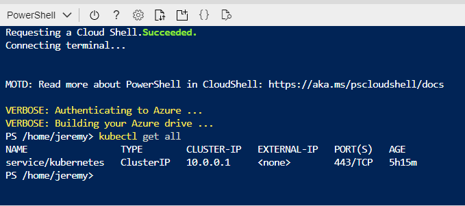
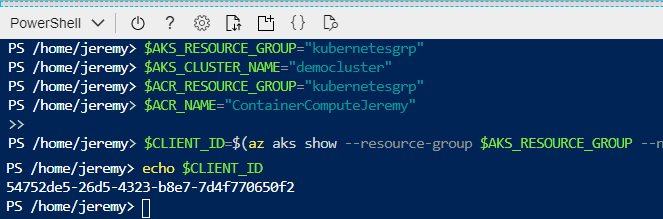
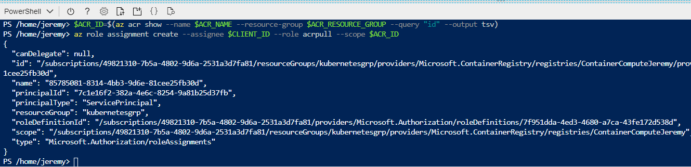
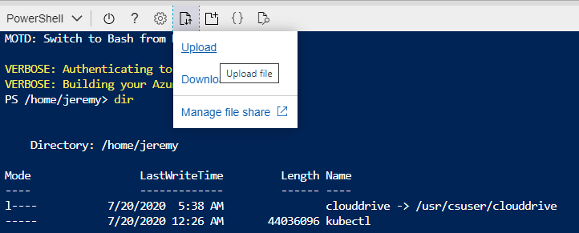
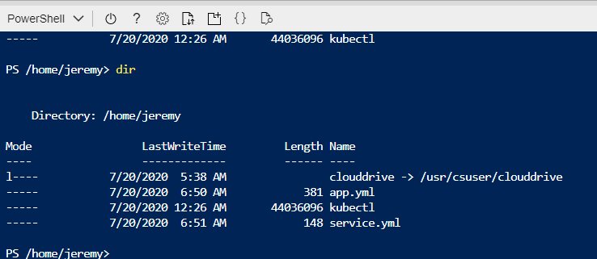
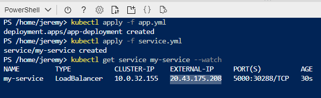
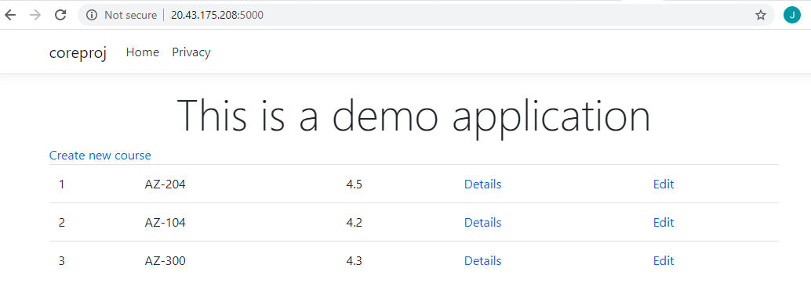

# Azure - Kubernetes Deployment

## Purpose
At the end of this module, you will:
* Setup a Deploy a Container to a Kubernetes Cluster using the CLI

## Deploying a Docker Container to an Azure Kubernetes cluster using CLI

### ![Building a Azure Kubernetes cluster][activity] 2.85.1 Check the running AKS has a running node

1. Open CloudShell in Powershell mode.

1. Check the running AKS has a running node.
```
kubectl get all
```




#### 2.85.2 Setting Service Principal Permissions

For the Kubernetes Cluster to talk to the Azure Container Registry it uses a Service Principal. We need to ensure the Service Principal has ACR pull permissions on the Container Registry.

1. Set the following variables:

```
$AKS_RESOURCE_GROUP="kubernetesgrp"
$AKS_CLUSTER_NAME="democluster"
```

And work these one's out yourself:
```
$ACR_RESOURCE_GROUP="using the az acr list command find this out yourself"
$ACR_NAME="using the az acr list command find this out"
```

2. Get the Client ID from our Cluster, we do this using the Service Principal Profile:

```
$CLIENT_ID=$(az aks show --resource-group $AKS_RESOURCE_GROUP --name $AKS_CLUSTER_NAME --query "servicePrincipalProfile.clientId" --output tsv)
```

3. To see the Service Principal Client ID of the cluster echo it out:

```
echo $CLIENT_ID
```




4. Next get the Resource ID of our Container Registry:

```
$ACR_ID=$(az acr show --name $ACR_NAME --resource-group $ACR_RESOURCE_GROUP --query "id" --output tsv)
```

5. Now we need to create a role assignment to ensure the Service Principal has the role of ACR pull on the Container Registry:
```
az role assignment create --assignee $CLIENT_ID --role acrpull --scope $ACR_ID
```




#### 2.85.3 Automate deployments to the Cluster

To automate deployments to the Cluster we create deployment files. These are YAML files we execute using the kubectl tool and based on what's in the configuration files it set's up the container application as a service on Kubernetes.

If you didn't download the Sample application with the Docker folder https://azuretrainingforncg.s3-ap-southeast-2.amazonaws.com/dotnetCoreApp.zip

In the downloaded sample there will be a Docker folder with two configuration files. 

1. Let's take a moment to examine two standard example deployment files.

A typical **app.yml** file:

```
apiVersion: apps/v1
kind: Deployment            <-- kind 
metadata:
  name: nginx-deployment    <-- meta data name 
spec:
  replicas: 1               <-- replica's (number of pods)
  selector:
    matchLabels:
      app: nginx-app        <-- app name
  template:
    metadata:
      labels:
        app: nginx-app      <-- app name
    spec:
      containers:
      - name: nginx              <-- your container name
        image: nginx:1.17.0      <-- Azure Kubernetes can pick up from Docker Container registry or Azure Container Registry
        ports:
        - containerPort: 80      <-- exposed port 80
```

A typical **services.yml** file:

```
apiVersion: v1
kind: Service            <-- kind 
metadata:
  name: nginx-service    <-- meta data name 
spec:
  type: LoadBalancer     <-- in the spec we set the type to LoadBalancer  
  ports:
  - port: 80             <-- exposed port 80
  selector:
    app: nginx-app      <-- same as the app name
```

2. Open up the app.yml and service.yml files in your downloads and examine the differences:
* we set our own meta data name
* we set the app name and matchlabels
* we set our own container name
* and finally the Docker Image that we uploaded to the Azure Container Registry

3. Important, you need to edit the app.yml file in notepad with the correct Azure Container Registry Name using az acr list.

3. Upload the app.yml and Service.yml files in CloudShell:



4. Check the files have uploaded successfully:



5. Go ahead and apply these files:

```
kubectl apply -f app.yml
kubectl apply -f service.yml
```

6. Next issue a get service command with the watch argument:

```
kubectl get service my-service --watch
```



7. After a while the External IP Address will be visible. Copy this External IP Address into a web browser followed by the port number :5000.



8. Have a little play with the web site, add some courses, edit some things and notice the speed we can get from .Net Core running on K8.

That completes this module where you gave the Service Princial an ACR role to Pull from the Azure Container Registry, configured an App.yml and a Service.Yml file to apply the Docker container image to the Kubernetes Cluster. Finally, you spun up the kubernetes service exposed on port 5000.

[activity]: ../icons/activity.png "Workshop Activity!"
[discussion]: ../icons/discussion.png "Team Discussion!"
[reading]: ../icons/reading.png "Further Reading!"
